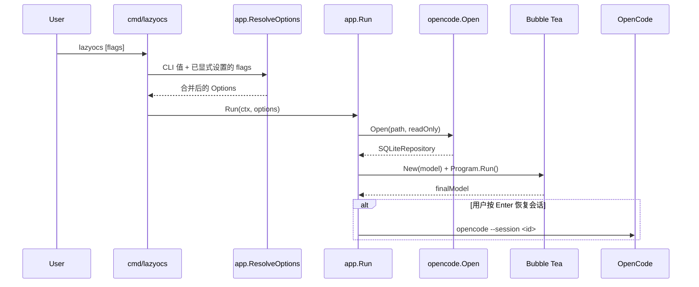
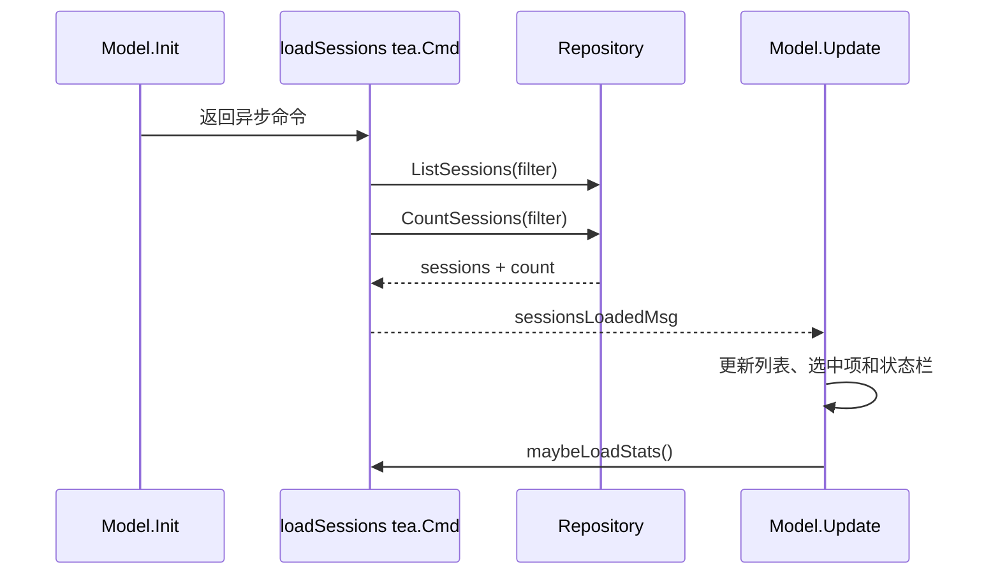

# 系统架构与数据流

## 1. 设计目标

架构围绕三个核心约束展开：

1. 启动和浏览必须快，不能因为 OpenCode 数据库很大就扫描聊天正文。
2. TUI 必须保持响应，数据库访问和外部命令不能阻塞事件循环。
3. 修改和删除属于高风险操作，数据源层必须支持真正的只读模式。

因此项目采用了一个较薄、依赖方向清晰的分层结构，而不是传统 Web 项目的多层 controller/service/DAO 模板。

## 2. 目录职责

```text
cmd/lazyocs/
  main.go                 CLI 入口、flag 解析、退出码

internal/app/
  app.go                  依赖组装、TUI 生命周期、恢复 OpenCode
  config.go               默认值、TOML、CLI 覆盖规则

internal/opencode/
  session.go              Session、Stats、Preview 等数据结构
  repository.go           TUI 所需的数据访问契约
  db.go                   SQLite 实现与 SQL

internal/tui/
  model.go                状态、Update、Command、View、交互逻辑
  styles.go               Lip Gloss 样式
  i18n.go                 中英文文案和语言解析

internal/platform/
  clipboard.go            Wayland/X11 剪贴板适配
```

依赖方向是：

```text
cmd -> app -> tui -> Repository interface
           -> opencode.SQLiteRepository
tui -> platform
```

TUI 不知道 SQLite DSN，也不包含 SQL；SQLite 层不知道键盘和渲染。这是当前架构最重要的边界。

## 3. 启动流程

入口位于 [`cmd/lazyocs/main.go`](../cmd/lazyocs/main.go)。主流程如下：



这里有一个值得说明的进程边界设计：`Enter` 不会在 alternate screen 内直接启动 OpenCode。TUI 只把 `resumeID` 写入最终 Model，然后退出；`app.Run` 恢复普通终端后再通过 `exec.CommandContext` 启动 OpenCode。这避免两个交互式终端程序争抢 stdin、stdout 和屏幕状态。

对应代码：

- [`Model.ResumeSessionID`](../internal/tui/model.go)
- [`app.Run`](../internal/app/app.go)
- [`exec.CommandContext`](../internal/app/app.go)

## 4. 读取数据流

### 4.1 首次加载



数据库访问发生在 `tea.Cmd` 中，不直接发生在按键处理逻辑里。结果通过消息回到 `Update`，保持单向状态流。

### 4.2 预览和统计懒加载

详情中的消息数量、part 数量和 payload 大小可能需要扫描关联记录，因此默认关闭。只有字段被启用且用户选中对应 session 时，`maybeLoadStats` 才触发查询。

消息预览更加明确：只有用户按 `p` 时才调用 `RecentUserMessages`，并限制记录数量和单条文本长度。

这种设计让“数据库文件很大”和“启动很慢”不必然等价。只要启动查询限定在较小的 session 元数据表，就不会因为 `part.data` 很大而加载全部 payload。

## 5. 写入数据流

### 5.1 修改标题

```text
e
 -> titleEdit = true
 -> 浮层接管键盘输入
 -> Enter 校验非空
 -> saveTitle tea.Cmd
 -> Repository.UpdateSessionTitle
 -> titleUpdatedMsg
 -> 更新内存中的 Session.Title
```

### 5.2 删除 session

```text
d
 -> deleteConfirm = true
 -> 删除浮层展示目标和风险
 -> y / Enter
 -> deleteBusy = true
 -> deleteSession tea.Cmd
 -> Repository.DeleteSession
 -> sessionDeletedMsg
 -> 从列表、统计缓存和预览缓存中移除
```

SQL 删除和 UI 状态更新被分开处理。数据库成功后才修改内存列表，避免 UI 显示“已删除”但数据库实际失败。

## 6. 为什么当前没有 service 层

当前业务规则主要是：

- 查询 session。
- 修改一个标题。
- 删除 session 树。
- 恢复指定 ID。

现在增加 `SessionService` 很可能只是把 Repository 方法原样转发一次，增加间接性但没有隔离新的业务复杂度。因此当前让 TUI 依赖 Repository 是合理的。

当出现以下需求时，service 层才有明确价值：

- 删除前计算影响范围。
- 删除前使用 SQLite Backup API 生成备份。
- 维护独立审计记录。
- 批量删除、批量导出或撤销。
- 根据 schema 兼容等级决定是否允许写入。

届时目标调用关系可以变成：

```text
TUI -> SessionService -> Repository
```

service 负责业务规则，Repository 仍只负责持久化。

## 7. 当前架构债务

### 7.1 `model.go` 职责过多

[`internal/tui/model.go`](../internal/tui/model.go) 当前同时包含状态、键盘状态机、异步命令、布局、浮层和格式化函数，已经超过 1000 行。

建议先做零行为变化的同包拆分：

```text
model.go       Model 和消息类型
update.go      Update、handleKey
commands.go    load/save/delete/copy 命令
view.go        列表、详情、状态栏
dialog.go      标题、删除、帮助浮层
format.go      时间、宽度、换行和高亮
```

这比立即引入新 package 更安全，也能显著降低代码阅读成本。

### 7.2 通用 `errMsg` 信息不足

所有异步失败都进入同一个 `errMsg`，调用者无法准确知道哪个操作失败，也就难以清理对应 busy 状态。更合理的是按操作定义失败消息，并携带 session ID。

### 7.3 领域模型混入文件系统状态

`Session.DirectoryExists` 不是 SQLite 字段，而是 TUI 加载后通过 `os.Stat` 补充的状态。当前规模下可以接受，但如果继续增加 Git 状态、项目名称等派生数据，应该增加独立 ViewModel 或查询服务，避免 `opencode.Session` 同时承担数据库行和界面模型两种职责。

### 7.4 Repository 接口略宽

TUI 实际不需要 `Close()`，关闭资源属于 app 组装层职责。未来可以将读取、写入和生命周期拆成更窄的接口，但目前接口只有少量方法，不值得单独重构。

## 8. 架构判断

当前架构不是“层数不足”，而是进入了需要整理包内职责的阶段。推荐顺序是：

1. 先修复异步状态和数据库安全问题。
2. 再按文件拆分 TUI。
3. 等备份、审计和批量操作出现后再增加 service 层。
4. 不为了展示设计模式而制造无业务价值的抽象。
