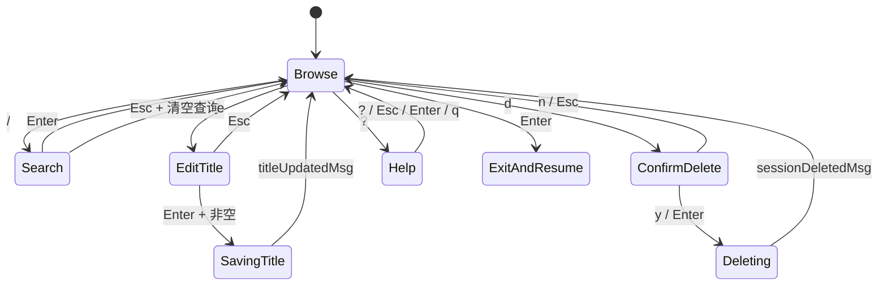

# TUI 状态机与交互实现

## 1. 技术模型

项目使用 Bubble Tea。它采用类似 Elm Architecture 的单向数据流：

```text
Model --View()--> terminal
  ^                  |
  |                  v
Update(msg) <---- keyboard / window / async result
  |
  +---- tea.Cmd ----> database / clipboard / timer
```

核心入口都在 [`internal/tui/model.go`](../internal/tui/model.go)：

- `Model`：完整界面状态。
- `Init`：返回首次加载命令。
- `Update`：处理窗口、异步结果和按键消息。
- `handleKey`：键盘状态机。
- `View`：把当前状态渲染成字符串。

Bubble Tea 的关键价值不是“方便画终端”，而是让状态变化集中发生在 `Update` 中。数据库 goroutine 不直接改 UI，降低并发共享状态的复杂度。

## 2. Model 中的状态分类

| 分类 | 代表字段 | 作用 |
| --- | --- | --- |
| 依赖 | `repo`、`opencode` | 数据访问和恢复命令 |
| 配置 | `limit`、`readOnly`、`fields` | 控制查询和展示 |
| 终端 | `width`、`height` | 响应式布局和可见区域 |
| 列表 | `sessions`、`selected`、`offset` | 会话列表和滚动窗口 |
| 搜索 | `query`、`mode`、`matched`、`total` | 搜索输入和结果统计 |
| 异步 | `loading`、`statsBusy`、`deleteBusy` | 防止重复请求和显示状态 |
| 浮层 | `help`、`titleEdit`、`deleteConfirm` | 键盘焦点和界面覆盖层 |
| 缓存 | `stats`、`preview`、`previewFor` | 避免重复加载 |
| 退出结果 | `resumeID` | 交给 app 层启动 OpenCode |

## 3. 键盘状态机

`handleKey` 按照“最上层交互优先”的顺序处理输入：

```text
Help modal
  > Title edit modal
  > Delete confirm modal
  > Search mode
  > Browse mode
```

当标题浮层打开时，`j`、`k`、`q` 都应该作为标题内容，而不是列表快捷键；当删除浮层打开时，只有确认、取消和退出键有效。优先级判断保证了键盘焦点不会穿透浮层。

主要状态转换如下：



## 4. 异步命令设计

数据库查询使用 `tea.Cmd`：

```go
func (m Model) loadPreview(sessionID string) tea.Cmd {
    return func() tea.Msg {
        ctx, cancel := context.WithTimeout(context.Background(), 2*time.Second)
        defer cancel()

        messages, err := m.repo.RecentUserMessages(ctx, sessionID, 5, 500)
        if err != nil {
            return previewLoadFailedMsg{sessionID: sessionID, err: err}
        }
        return previewLoadedMsg{sessionID: sessionID, messages: messages}
    }
}
```

这个模式具有三个优点：

1. SQL 不会直接阻塞按键处理函数。
2. 结果是不可变消息，统一由 `Update` 更新状态。
3. 每个查询有超时，不会无限占用连接。

session 元数据和近期用户消息分别异步加载。任一结果返回后，`Update` 更新内存目录并针对当前 query 重新过滤，因此较晚返回的记忆数据可以无缝补充搜索结果。

搜索输入使用 100ms debounce。每次文字输入和退格都会递增 `searchVersion`，只有版本仍然最新的 `searchDebounceMsg` 才会执行内存过滤；`Enter` 会立即提交待处理查询，`Esc` 会立即清空。输入阶段不再重复访问 SQLite。

## 5. 列表与响应式布局

`View` 根据终端宽度选择布局：

- 宽度小于 110：只显示会话列表。
- 宽度达到 110：按约 45%/55% 显示列表和详情。

`selected` 表示全局选中索引，`offset` 表示当前可见窗口起点。`ensureVisible` 保证选中项始终位于可见区域；`visibleItems` 根据终端高度计算最多展示多少 session。

文本宽度使用 `lipgloss.Width` 而不是 `len`，因为中文和部分 Unicode 字符占两个终端 cell。截断、对齐和浮层宽度都必须按终端显示宽度计算。

## 6. 搜索模式

搜索包含三个层次：

1. TUI 使用 `strings.Fields` 将 query 解析成多个关键词。
2. 启动时异步加载精简 session 元数据和最近 N 天用户消息。
3. TUI 在内存中组合匹配，关键词之间使用 AND 语义。

例如：

```text
windows iso
```

语义不是匹配完整短语，而是 title、directory、session ID、project ID、model、agent 和近期用户消息的组合文本中必须同时出现 `windows` 和 `iso`。两个词可以分别命中标题和用户消息。

搜索模式下普通 `j/k/p` 被视为输入内容，列表导航改用方向键或 `Ctrl-J/Ctrl-K`，预览改用 `Ctrl-P`。这是键盘优先工具里避免快捷键和文本输入冲突的处理。

## 7. 浮层实现

标题编辑、删除确认和帮助面板共用自定义浮层，而不是简单在状态栏显示提示或切换成独立页面。相关函数：

- `renderTitleDialog`
- `renderDeleteDialog`
- `renderDialog`
- `renderOverlay`

视觉层次包括：

- 轻微蓝紫色的深灰背景。
- 低饱和浅黄绿色单线边框。
- 类似 HTML fieldset legend 的断边标题。
- 标题输入使用无独立描边的紧凑文本行。
- 弱化的青蓝编辑图标和浅黄绿色光标。
- cyan 快捷键与暗灰蓝操作说明。
- 背景内容使用 faint 样式压暗。

终端不像浏览器有绝对定位和透明图层，因此 `renderOverlay` 使用 `x/cellbuf` 做固定矩形的 cell 级合成：

1. 先渲染完整主界面。
2. 将 ANSI 字符串解析为 `width × height` 的终端 cell buffer。
3. 对背景 cell 应用 faint，并根据终端和对话框尺寸计算居中矩形。
4. 使用 `SetContentRect` 在固定坐标覆盖弹窗。
5. 对整个弹窗矩形统一施加背景色，避免嵌套 ANSI reset 产生色块断层。
6. 逐行重新输出 ANSI 字符串，保留 grapheme、宽字符和样式边界。

标题很长时，`tailWidth` 保留靠近光标的末尾文本，而不是始终展示开头，这更符合输入框编辑体验。

终端程序无法指定 JetBrains Mono 或 Iosevka，字体由终端模拟器决定；程序能控制的是颜色、字重、边框、宽度和字符选择。

## 8. 删除交互的一致性

删除操作使用两个层面的保护：

1. 浏览态按 `d` 只进入确认态，不执行 SQL。
2. 确认态按 `y` 或 `Enter` 才发出删除命令。

`deleteBusy` 防止 SQL 执行期间重复提交。删除成功后会清理：

- 当前 session 列表项。
- 对应 stats 缓存。
- stats busy 标记。
- preview 内容和归属 ID。
- matched 和 total 数量。

删除失败时必须重新释放 `deleteBusy`，否则浮层会一直拦截所有按键。这个失败路径已经加入单元测试。

## 9. 当前需要改进的地方

### 9.1 已完成：操作级错误消息

通用 `errMsg` 已拆分为 list、preview、stats、save、delete 和 clipboard 对应的失败消息。每个分支只恢复自己负责的 loading、busy、弹窗和状态栏，过期 query 或非当前 session 的失败消息不会覆盖当前状态。

### 9.2 已完成：异步剪贴板

复制操作已从按键处理路径移入 `copySessionID tea.Cmd`，通过 `clipboardCopiedMsg` 或 `clipboardCopyFailedMsg` 回到 `Update`。系统命令由带两秒超时的 context 控制，不再占用 TUI 事件循环。

### 9.3 标题保存需要独立 busy 状态

删除已经使用 `deleteBusy`，标题保存也应该有 `titleBusy`，防止用户连续按 Enter 发起重复更新。

### 9.4 增加状态机测试

目前测试覆盖了格式化、对齐、浮层结构和删除失败解锁，但 `handleKey` 主状态机覆盖不足。建议使用 fake Repository 验证：

- 浏览、搜索、编辑、删除之间的切换。
- 只读模式拒绝写操作。
- 旧搜索结果不会覆盖新 query。
- 删除成功后的选中项和缓存清理。
- 窄终端下浮层仍保持合法宽度。
