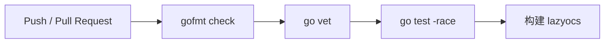

# 上线准备与后续演进

## 1. 当前成熟度判断

当前版本适合作为：

- 个人日常工具。
- 求职作品和技术演示。
- 小范围邀请测试版本。

在补齐数据库兼容检查和删除安全措施前，不建议直接把它描述成“可无风险管理任意 OpenCode 数据库的稳定版本”。直接访问上游内部数据库时，诚实定义兼容边界本身也是工程能力的一部分。

## 2. 上线红线

### P0：公开发布前必须完成

| 项目 | 当前问题 | 验收标准 |
| --- | --- | --- |
| 异步剪贴板 | 已完成：外部命令已移入带超时的 `tea.Cmd` | 复制通过 `tea.Cmd` 执行，状态通过消息回流 |
| stats 错误恢复 | 已完成：失败消息会释放对应 `statsBusy` | 超时或 SQL 错误后可以再次加载 |
| 搜索 debounce | 已完成：使用 100ms debounce 和版本校验 | 80-150ms 内只执行最后一次有效查询 |
| Schema 检查 | 已完成：启动检查五项能力，危险写操作 fail closed | 启动时输出兼容等级，写入必须 fail closed |
| 外键集成测试 | 已完成：测试正式 `Open()`、FK、只读和缺失文件 | 自动验证生产 DSN 的 FK 和只读行为 |
| 递归安全 | 已使用 `union` 去重并覆盖 parent 环 | 保持回归测试 |
| 删除范围 | 已完成：异步统计并在事务中复核 session/message/part 数量 | 浮层展示后代数量和完整级联范围 |

### P1：第一个稳定版本建议完成

- 将 `internal/tui/model.go` 按职责拆成多个同 package 文件。
- 已完成：标题保存增加 busy 状态并过滤控制字符。
- 删除前提供可选 SQLite 一致性备份。
- 为数据库锁定、schema 不兼容和剪贴板失败提供可操作错误信息。
- 增加 macOS 剪贴板支持，明确 Windows 支持状态。
- 为启动、搜索、预览和统计建立 benchmark。
- 为窄终端、tmux、SSH、Wayland 和 X11 做手工验收。

### P2：根据用户反馈决定

- 项目名称和目录筛选。
- 按项目分组显示 session。
- keyset pagination。
- 独立 sidecar FTS 全文索引。
- session 导出、备份和恢复。
- Kitty、WezTerm 或 tmux 新 tab/split 恢复。
- 操作历史和批量管理。

## 3. 默认读写策略

个人工具可以保留默认读写，以减少修改标题和删除的操作成本；公开发布则需要在便利性和数据安全之间明确取舍。

推荐两种可选策略：

### 安全优先

```text
默认 read-only
用户显式 --write 或配置 write_enabled=true
状态栏持续显示 READ-WRITE
```

### 体验优先

```text
默认 read-write
状态栏持续显示 WRITE ENABLED
删除必须二次确认并显示影响范围
Schema 未验证时自动降级只读
```

无论选择哪一种，不能只依赖“隐藏按键”。只读必须通过 SQLite `mode=ro` 实现。

## 4. 持续集成

项目已增加最小 GitHub Actions CI：



Pull Request 阶段：

```bash
test -z "$(gofmt -l .)"
go vet ./...
go test -race ./...
go build ./cmd/lazyocs
```

项目不是线上服务，因此不配置部署型 CD。等确实需要向用户提供多平台预编译包时，再增加 Tag 驱动的 GoReleaser 和版本注入：

```bash
go build \
  -ldflags "-s -w -X main.version=${VERSION}" \
  -o lazyocs \
  ./cmd/lazyocs
```

当前 `cmd/lazyocs/main.go` 已保留：

```go
var version = "dev"
```

因此不需要修改运行时代码即可注入正式版本号。

## 5. 发布目标

项目使用 `modernc.org/sqlite`，不依赖 CGO，适合交叉编译。建议第一阶段发布：

```text
linux/amd64
linux/arm64
darwin/amd64
darwin/arm64
```

Windows 是否发布取决于：

- OpenCode 数据目录是否已确认。
- alternate screen 和终端兼容性是否验证。
- 剪贴板实现是否补齐。
- 路径和 `~` 展开语义是否测试。

发布物至少包括：

- 压缩后的单二进制文件。
- SHA256 校验文件。
- CHANGELOG。
- LICENSE。
- 支持的 OpenCode 版本或 schema 范围。

## 6. 可观测性

本地 TUI 不需要引入服务器级监控，但正式版本需要最小调试能力。

建议增加可选日志：

```text
--debug-log /path/to/lazyocs.log
```

或者遵循 XDG：

```text
~/.local/state/lazyocs/lazyocs.log
```

建议记录：

- 应用版本。
- 数据库路径的脱敏表示。
- schema 兼容检查结果。
- 查询类别、耗时和错误。
- 修改或删除的 session ID、时间和影响数量。

不建议记录：

- 用户消息正文。
- 完整预览内容。
- 可能包含秘密的标题或目录，除非 debug 模式明确说明。

## 7. 性能验收

建议建立明确而不是模糊的性能目标：

| 场景 | 初步目标 |
| --- | ---: |
| 启动并显示首屏 | 本机常用数据库下低于 500ms |
| 列表移动 | 无可感知阻塞 |
| 搜索输入 | debounce 后结果快速更新，不积压请求 |
| 最近消息预览 | 正常 session 低于 300ms |
| 数据库锁定 | 超时后给出错误，TUI 不冻结 |

这些值应在 CI 外使用生成数据和真实数据分别验证。真实数据库不能提交到仓库，生成 fixture 不能包含个人消息。

## 8. 数据兼容策略

OpenCode 数据库 schema 不是 lazyocs 控制的公共 API。建议每次发布记录一个兼容矩阵：

| lazyocs | OpenCode/schema | 浏览 | 预览 | 修改 | 删除 |
| --- | --- | --- | --- | --- | --- |
| 当前开发版 | 已验证 schema | 支持 | 支持 | 支持 | 支持 |
| 未识别 schema | 未验证 | 视必要字段 | 禁用或警告 | 禁止 | 禁止 |

写操作必须比读操作采用更严格的兼容标准。即使新 schema 仍能显示列表，也不代表可以安全删除。

## 9. 分阶段架构演进

### 阶段一：整理而不重构

- 修复 P0 问题。
- 已完成：按状态、事件、命令、视图、浮层和格式化拆分 `model.go`。
- 增加测试和 CI。
- 保持现有 package 边界。

### 阶段二：形成写操作用例层

当备份和审计实现后，引入：

```text
internal/sessionservice
```

它负责：

```text
AnalyzeDelete
BackupSessionData
DeleteSessionTree
UpdateTitle
CheckWriteCompatibility
```

此时 TUI 不再自己拼接删除业务流程，但 Repository 仍负责 SQL。

### 阶段三：独立索引和多数据源

只有在元数据数量或全文搜索成为真实瓶颈后，再考虑：

```text
OpenCode DB -> read adapter
             -> sidecar index
             -> search service
```

不要在没有 benchmark 的情况下提前引入后台 daemon、缓存服务器或同步系统。

## 10. 求职展示建议

项目介绍时建议按“问题、约束、方案、取舍、结果、下一步”讲述：

1. 问题：OpenCode 历史会话多，原生列表难以定位。
2. 约束：数据库可能很大，且 schema 属于上游内部实现。
3. 方案：Go 单二进制、Bubble Tea 单向状态流、Repository 隔离、元数据优先和 payload 懒加载。
4. 取舍：MVP 不做全文索引，不为了形式引入 service 层。
5. 结果：完成浏览、搜索、预览、恢复、修改、删除和配置化界面。
6. 下一步：可选一致性备份、标题输入加固和首个版本发布材料。

面试中主动说明现有风险通常比声称“项目已经完全生产可用”更有说服力。它体现的是能识别系统边界、安排优先级并做工程取舍。
