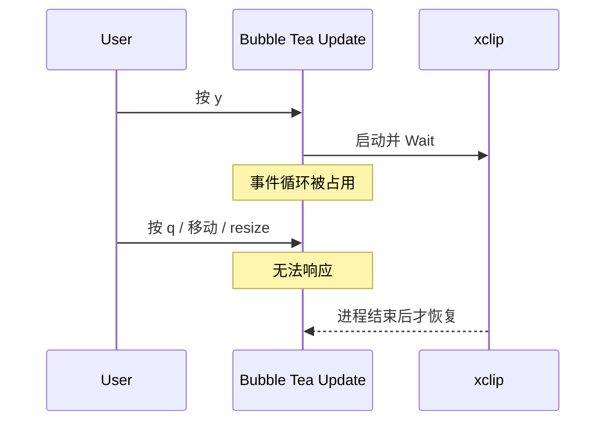
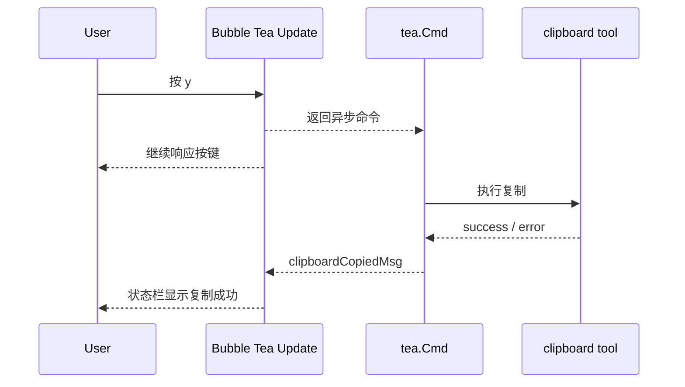
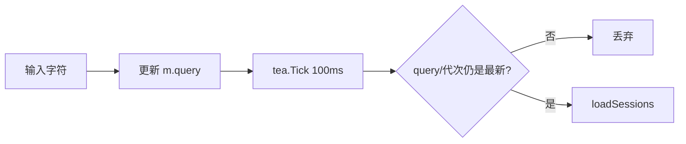
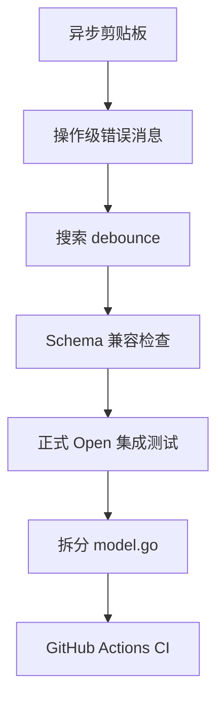

# 上线前稳定性改造：Before / After

## 1. 这轮改造要解决什么

当前 `lazyocs` 已经完成浏览、搜索、预览、恢复、改名和删除等主要功能，具备完整的个人使用路径。

下一阶段不急着继续增加功能，而是把项目从“功能可用的 MVP”提升到“可以放心公开发布的工具”。重点不是让代码看起来更复杂，而是解决真实运行中的稳定性、兼容性和可维护性问题。

本文以提交 `bfdc1b3` 作为改造前基线，直观展示每项工作的作用和预期变化。

> 实施进度（2026-09-03）：七项稳定性工作已经完成。第七项按 CLI 项目实际需求落地为持续集成；部署型 CD 不适用，GoReleaser 延后到需要提供预编译版本时再配置。

## 2. 总览

| 改造项 | Before | After | 用户直接感受 |
| --- | --- | --- | --- |
| 异步剪贴板 | 复制命令可能阻塞 TUI | 复制在 `tea.Cmd` 中执行 | 按 `y` 后界面始终可响应 |
| 操作级错误消息 | 所有失败共用 `errMsg` | 每种操作有独立成功/失败消息 | 出错后 loading、弹窗和重试状态正确 |
| 搜索 debounce | 每输入一个字符就查询数据库 | 停止输入约 100ms 后只查最新关键词 | 连续输入更流畅，数据库压力更小 |
| Schema 兼容检查 | 直接假设 OpenCode 表结构不变 | 启动时检测读写能力并 fail closed | OpenCode 升级后不会盲目写库 |
| 正式连接集成测试 | 测试绕过真实 `Open()` 路径 | 测试真实 DSN、pragma 和只读模式 | 外键和写保护不再只靠人工确认 |
| 拆分 `model.go` | 1000 多行集中在一个文件 | 按状态、事件、命令、视图拆文件 | 功能更容易定位和评审 |
| 持续集成 | 依赖本机手动测试和构建 | Push/PR 自动格式检查、测试和构建 | 回归能在合并前被发现 |

## 3. 改造一：异步剪贴板

### 3.1 它是干什么的

用户按 `y` 时，lazyocs 会把当前 session ID 发送给：

```text
wl-copy
xclip
xsel
```

当前实现位于：

- [`internal/tui/model.go`](../internal/tui/model.go) 的 `handleKey`
- [`internal/platform/clipboard.go`](../internal/platform/clipboard.go) 的 `Copy`

### 3.2 Before

当前按键处理会直接调用外部命令：

```text
用户按 y
  -> Model.Update / handleKey
  -> platform.Copy
  -> cmd.Start
  -> 写入 stdin
  -> cmd.Wait
  -> 更新状态栏
```

问题在于 Bubble Tea 的 `Update` 是核心事件循环。如果外部程序迟迟不退出，整个界面就无法继续处理按键、resize 和重绘。



用户可见症状：

- 按 `y` 后界面像卡死。
- `q`、方向键暂时无效。
- resize 后不能及时重绘。
- 用户无法区分“正在复制”和“程序崩溃”。

### 3.3 After

复制改成 Bubble Tea 异步命令：

```text
用户按 y
  -> 返回 copySessionID tea.Cmd
  -> Update 立即结束
  -> 后台执行 platform.Copy
  -> clipboardCopiedMsg / clipboardCopyFailedMsg
  -> Update 更新状态栏
```



当前消息结构：

```go
type clipboardCopiedMsg struct{}

type clipboardCopyFailedMsg struct {
    sessionID string
    err       error
}
```

### 3.4 对比

| 场景 | Before | After |
| --- | --- | --- |
| 正常复制 | 同步等待外部命令 | 后台复制，状态消息回流 |
| xclip 不退出 | 整个 TUI 冻结 | TUI 继续响应，可显示超时或错误 |
| 没有剪贴板工具 | 同步返回错误 | 异步降级显示 session ID |
| 测试方式 | 需要真实系统工具 | 可通过 fake executable 测试 |

### 3.5 验收标准

- 按 `y` 后列表移动和退出仍然可用。
- 剪贴板工具失败时显示明确状态。
- 测试不依赖 CI 机器安装 Wayland/X11。
- 不改变 `y` 的快捷键含义。

## 4. 改造二：操作级错误消息

### 4.1 它是干什么的

TUI 中有多种异步操作：

```text
加载列表
加载统计
加载预览
保存标题
删除 session
复制 ID
```

每种操作都有不同的状态清理要求。例如统计失败后要释放 `statsBusy[sessionID]`，删除失败后要释放 `deleteBusy` 并保留确认框。

### 4.2 Before

当前大部分错误最终都变成：

```go
type errMsg struct {
    err error
}
```

`Update` 只知道“某件事失败了”，不知道：

- 哪个操作失败。
- 对应哪个 session。
- 应该关闭还是保留弹窗。
- 应该清除哪个 busy 标记。
- 用户是否可以重试。

典型问题：

```text
统计加载开始
  -> statsBusy[ses_xxx] = true
  -> SQL 超时
  -> errMsg
  -> 不知道应该清理哪个 statsBusy
  -> 当前 session 永久显示“正在加载”
```

### 4.3 After

按操作定义消息：

```go
type sessionsLoadFailedMsg struct {
    query string
    err   error
}

type statsLoadFailedMsg struct {
    sessionID string
    err       error
}

type titleUpdateFailedMsg struct {
    sessionID string
    err       error
}

type sessionDeleteFailedMsg struct {
    sessionID string
    err       error
}
```

对应状态恢复变得明确：

```text
statsLoadFailedMsg
  -> delete(statsBusy, sessionID)
  -> 保留其他 session 的缓存
  -> 状态栏显示统计加载失败

sessionDeleteFailedMsg
  -> deleteBusy = false
  -> deleteConfirm = true
  -> 用户可以重试或 Esc 取消
```

### 4.4 对比

| 维度 | Before | After |
| --- | --- | --- |
| 错误上下文 | 只有 error | 操作类型 + session ID + query |
| busy 清理 | 容易遗漏 | 每个消息明确负责自己的状态 |
| 用户提示 | 底层错误字符串 | 可提供操作相关提示 |
| 测试 | 难验证具体失败路径 | 可直接发送指定失败消息 |
| 后续扩展 | 每加功能都修改通用分支 | 每项操作拥有独立生命周期 |

### 4.5 这不是“为了多写类型”

这些消息类型不是没有价值的包装。它们把异步任务的身份和恢复逻辑带回单线程 `Update`，用于消除模糊状态和 busy 泄漏。

### 4.6 验收标准

- stats 超时后可以重新加载。
- 删除失败后可以重试或取消。
- 保存失败后标题输入内容不会丢失。
- 列表查询失败不会错误关闭其他浮层。
- 每个失败路径都有独立测试。

## 5. 改造三：搜索 debounce

### 5.1 它是干什么的

Debounce 表示用户连续输入时不立即执行每一次中间查询，而是等待一个很短的安静窗口，例如 100ms，只执行最后一次有效查询。

### 5.2 Before

输入：

```text
o p e n c o d e
```

可能产生：

```text
查询 o
查询 op
查询 ope
查询 open
查询 openc
查询 openco
查询 opencod
查询 opencode
```

而每次加载还可能包含：

```text
ListSessions
CountSessions(匹配数)
CountSessions(总数)
```

8 次按键可能变成约 24 次 SQL。

现有代码会丢弃已经过期的结果，因此最终结果通常正确，但已经发出的数据库工作不会消失。

### 5.3 After

```text
输入 o       -> 安排 100ms tick，代次 1
输入 p       -> 安排 100ms tick，代次 2
输入 e       -> 安排 100ms tick，代次 3
...
输入 opencode -> 安排 100ms tick，代次 8

tick 1-7 返回 -> 代次不匹配，忽略且不查询
tick 8 返回   -> query 仍有效，执行一次数据库查询
```



### 5.4 对比

| 输入过程 | Before | After |
| --- | ---: | ---: |
| 连续输入 8 个字符 | 最多约 8 轮查询 | 通常 1 轮查询 |
| 快速退格 | 每次退格立即查询 | 停止操作后查询最新值 |
| 最终结果 | 正确 | 正确 |
| 数据库压力 | 随按键数增长 | 随用户停顿次数增长 |
| 主观体验 | 可能出现 loading 抖动 | 输入和结果更新更稳定 |

### 5.5 为什么先 debounce，不先上 FTS

当前只搜索 session 元数据，没有默认扫描 message/part payload。真实瓶颈首先是重复查询，而不是搜索算法本身。

在没有 benchmark 证明元数据规模已经达到瓶颈之前，引入 FTS、后台索引和同步逻辑会显著增加复杂度。

### 5.6 验收标准

- debounce 保持在约 80-150ms。
- 连续输入只执行最后一次有效查询。
- `Esc` 清空搜索仍立即生效。
- 方向键和 `Ctrl-J/Ctrl-K` 不触发无意义查询。
- 测试使用可控时间，不依赖真实 sleep 造成不稳定。

## 6. 改造四：OpenCode Schema 兼容检查

### 6.1 它是干什么的

lazyocs 直接读取 OpenCode 的 SQLite 数据库。这个 schema 由 OpenCode 控制，不是 lazyocs 自己的稳定 API。

OpenCode 升级后可能：

- 增加字段。
- 删除或重命名字段。
- 改变外键关系。
- 改变 JSON 数据结构。
- 改变删除级联规则。

### 6.2 Before

当前启动后直接执行固定 SQL：

```sql
select model, agent, tokens_cache_read ... from session;
```

如果字段不存在，用户可能只看到：

```text
SQL logic error: no such column: agent
```

更危险的情况是列表仍能读取，但外键关系已经改变，工具却继续允许删除。

### 6.3 After

打开数据库后先检查：

```sql
pragma table_info(session);
pragma table_info(message);
pragma table_info(part);
pragma foreign_key_list(message);
pragma foreign_key_list(part);
```

将兼容性分成能力，而不是简单的 true/false：

| 能力 | 检查内容 | 不兼容时行为 |
| --- | --- | --- |
| Browse | session 基础字段 | 拒绝启动并说明版本问题 |
| Stats | message/part 的 session_id 和 data | 返回明确的能力错误 |
| Preview | message/part 关系、data 和时间字段 | 返回明确的能力错误 |
| Rename | session.id/title 存在 | Repository 拒绝改名 |
| Delete | parent 关系和两级外键级联符合预期 | Repository 强制禁止删除 |

核心原则是 fail closed：

```text
不能证明写操作安全
    等价于
不允许写操作
```

### 6.4 对比

| 场景 | Before | After |
| --- | --- | --- |
| OpenCode 新增字段 | 通常无影响 | 兼容检查通过 |
| 缺少详情字段 | 裸 SQL 错误 | 明确指出不兼容字段 |
| 外键发生变化 | 仍可能显示删除按键 | 自动禁用删除 |
| 用户排查 | 不知道是路径、锁还是版本 | `--check` 输出兼容能力 |
| 数据安全 | 假设上游不变 | 写操作需要显式安全证据 |

### 6.5 验收标准

- 支持的 schema 正常通过。
- 缺少基础字段时返回人类可读错误。
- 外键不符合预期时浏览可用但写入禁用。
- `--check` 输出数据库路径和兼容性结果。
- 不向 OpenCode 数据库创建 lazyocs 私有表或字段。

## 7. 改造五：正式数据库打开路径集成测试

### 7.1 它是干什么的

单元测试可以证明某条 SQL 在一个手工构造的 `sql.DB` 上有效，但不能证明生产中的 DSN 参数、只读模式和 pragma 真正生效。

### 7.2 Before

当前删除测试大致采用：

```go
db, _ := sql.Open("sqlite", ":memory:")
db.Exec("pragma foreign_keys = on")
repo := &SQLiteRepository{db: db}
```

这绕过了正式入口：

```go
opencode.Open(ctx, path, readOnly)
```

因此即使未来有人误删 DSN 中的：

```text
_pragma=foreign_keys(ON)
mode=ro
mode=rw
```

现有删除测试仍可能全部通过。

### 7.3 After

测试在 `t.TempDir()` 中创建真实文件数据库，然后只通过生产入口打开：

```text
创建临时 opencode.db
  -> 写入最小 schema 和测试数据
  -> repo = Open(path, true/false)
  -> 查询 pragma
  -> 执行真实 Repository 操作
  -> 断言文件和关联数据
```

### 7.4 对比

| 验证内容 | Before | After |
| --- | --- | --- |
| SQL 本身 | 能验证 | 能验证 |
| DSN URL 编码 | 未验证 | 验证 |
| `foreign_keys(ON)` | 测试手工开启 | 验证生产入口 |
| `mode=ro` | 未验证 | 验证拒绝写入 |
| `mode=rw` 不创建文件 | 未验证 | 验证 |
| Close/文件连接 | 很少覆盖 | 真实文件路径覆盖 |

### 7.5 验收标准

- 只读 Repository 更新标题和删除都会失败。
- 读写模式不会创建不存在的数据库。
- 正式 `Open()` 后 `foreign_keys` 为 1。
- 删除根 session 后 message 和 part 被级联删除。
- 测试结束后连接关闭，临时文件可清理。

## 8. 改造六：拆分 `model.go`（已完成）

### 8.1 它是干什么的

改造前 [`internal/tui/model.go`](../internal/tui/model.go) 超过 1000 行，同时包含：

```text
Model 状态
消息类型
Update
按键处理
数据库命令
列表渲染
详情渲染
弹窗渲染
ANSI/cell buffer 合成
格式化函数
滚动计算
```

代码仍然能工作，但定位一个功能需要在很长的文件中来回跳转。

### 8.2 Before

```text
internal/tui/
  model.go      绝大部分逻辑
  styles.go
  i18n.go
```

风险：

- 多个功能修改同一个文件，Git 冲突概率增加。
- 状态机和纯格式化函数混在一起。
- 面试官阅读入口不清晰。
- 后续修复容易顺手碰到无关代码。

### 8.3 After

保持同一个 `tui` package，只做文件级职责拆分：

```text
internal/tui/
  model.go       Model、Options、消息类型、New、Init
  update.go      Update、handleKey
  commands.go    load/save/delete/copy tea.Cmd
  view.go        列表、详情、状态栏
  dialog.go      Save as、Delete、Help、overlay
  format.go      时间、宽度、换行、高亮
  styles.go
  i18n.go
```

调用关系和导出 API 不变，不增加新的 package，也不引入只做转发的抽象。

### 8.4 对比

| 维度 | Before | After |
| --- | --- | --- |
| 修改弹窗 | 在 1000 多行文件中定位 | 直接打开 `dialog.go` |
| 修改按键 | 与渲染函数混合 | 集中在 `update.go` |
| 修改异步任务 | 分散在 Model 后半段 | 集中在 `commands.go` |
| Package 数量 | 1 | 仍然是 1 |
| 行为变化 | 不适用 | 不允许发生 |
| 评审难度 | 大 diff 容易混入行为 | 先纯拆分，再单独改行为 |

### 8.5 为什么不立刻加 service 层

文件拆分解决的是可读性，不等于业务分层。当前 Repository 方法仍然简单，加入 service 很可能只增加一次转发。

等删除备份、影响分析、审计和批量操作出现后，再引入真正承载业务规则的 service。

### 8.6 验收标准

- 对外 API 和按键行为完全不变。
- 纯移动提交前后所有测试结果一致。
- 每个文件具有清晰单一主题。
- 不产生循环依赖和新 package。

## 9. 改造七：持续集成（已完成）

### 9.1 它是干什么的

CI 保证每次提交都经过同一套自动验证。lazyocs 不是线上服务，因此不配置部署型 CD；版本发布自动化等真正提供预编译包时再增加。

### 9.2 Before

```text
本机修改
  -> 手工 go test
  -> 手工 go build
  -> 得到一个本机 lazyocs 文件
```

问题：

- 容易忘记 race 或 vet。
- 无法证明其他平台可以编译。
- `--version` 可能仍显示 `dev`。
- 用户无法校验下载文件。
- 发布步骤不可重复。

### 9.3 After

Pull Request / Push：

```text
gofmt check
  -> go vet ./...
  -> go test -race ./...
  -> go build ./cmd/lazyocs
```

未来需要提供预编译版本时可增加：

```text
Tag v0.x.x
  -> GoReleaser
  -> Linux amd64/arm64
  -> macOS amd64/arm64
  -> 注入版本号
  -> 生成 SHA256
  -> 创建 GitHub Release
```

### 9.4 对比

| 能力 | Before | After |
| --- | --- | --- |
| 测试执行 | 依赖开发者记忆 | 每次提交自动执行 |
| Race 检查 | 手工 | CI 固定执行 |
| Linux 构建 | 手工验证 | CI 自动验证 |
| 跨平台发布 | 未持续验证 | 需要预编译包时再配置 |
| 版本号与发布文件 | 默认 `dev`、本机构建 | 留待首次正式发布处理 |
| 可追溯性 | 弱 | CI 结果对应明确 commit |

### 9.5 验收标准

- 不符合 gofmt 的提交无法通过 CI。
- 测试、race、vet 或构建失败时不能合并。
- Workflow 只需要只读仓库权限。
- 不包含线上部署步骤。

## 10. 推荐实施顺序



实际执行时，Schema 检查与正式 Open 集成测试可以放在同一阶段，因为它们都围绕数据库连接契约。

推荐分成以下提交：

```text
1. 异步化剪贴板并增加 fake command 测试
2. 类型化异步错误并修复 busy 状态
3. 增加搜索 debounce 和代次测试
4. 增加 schema 能力检测和正式 Open 集成测试
5. 纯拆分 TUI 文件，不改变行为
6. 增加最小 CI；版本注入和发布配置按实际发布需求延后
```

每条提交都应该独立通过测试，避免把行为修复和大规模文件移动放进同一个 diff。

## 11. 改造完成后的整体变化

### Before：功能型 MVP

```text
功能完整
本机可以使用
主要查询有测试
手工构建
依赖开发者了解数据库版本
部分失败状态需要重启恢复
```

### After：可公开发布的本地工具

```text
事件循环不被外部命令阻塞
每个异步任务都能正确成功、失败和重试
搜索不会制造无意义查询风暴
数据库能力在启动时得到验证
只读、外键和级联通过正式连接测试
TUI 文件职责清晰
每次提交都自动验证
```

## 12. 面试时怎么讲

可以把这一阶段概括为：

> 第一阶段解决“用户能不能完成任务”，第二阶段解决“异常发生时系统能不能保持正确”。我没有急着增加全文搜索或图表，而是先处理事件循环阻塞、异步状态泄漏、上游 schema 漂移和可重复发布，因为这些问题决定了工具能否从个人脚本变成可靠产品。

每个技术点可以对应一种工程能力：

| 技术点 | 展现的能力 |
| --- | --- |
| `tea.Cmd` 异步剪贴板 | 事件驱动和并发边界 |
| 类型化消息 | 状态机建模和错误恢复 |
| Debounce | 性能优化和请求治理 |
| Schema 检查 | 外部依赖兼容和数据安全 |
| 文件数据库集成测试 | 测试金字塔和生产路径验证 |
| 同包文件拆分 | 控制抽象、可维护性重构 |
| GitHub Actions CI | 持续集成和质量门禁 |

## 13. 最终判断

这些工作不会给界面增加大量新按钮，但会显著提高项目质量：

```text
用户看到的是：更流畅、更可靠、错误后能恢复
开发者看到的是：边界明确、状态可推理、测试覆盖生产路径
招聘方看到的是：不仅会完成功能，也理解上线和长期维护
```

这也是下一阶段比继续堆功能更有价值的原因。
