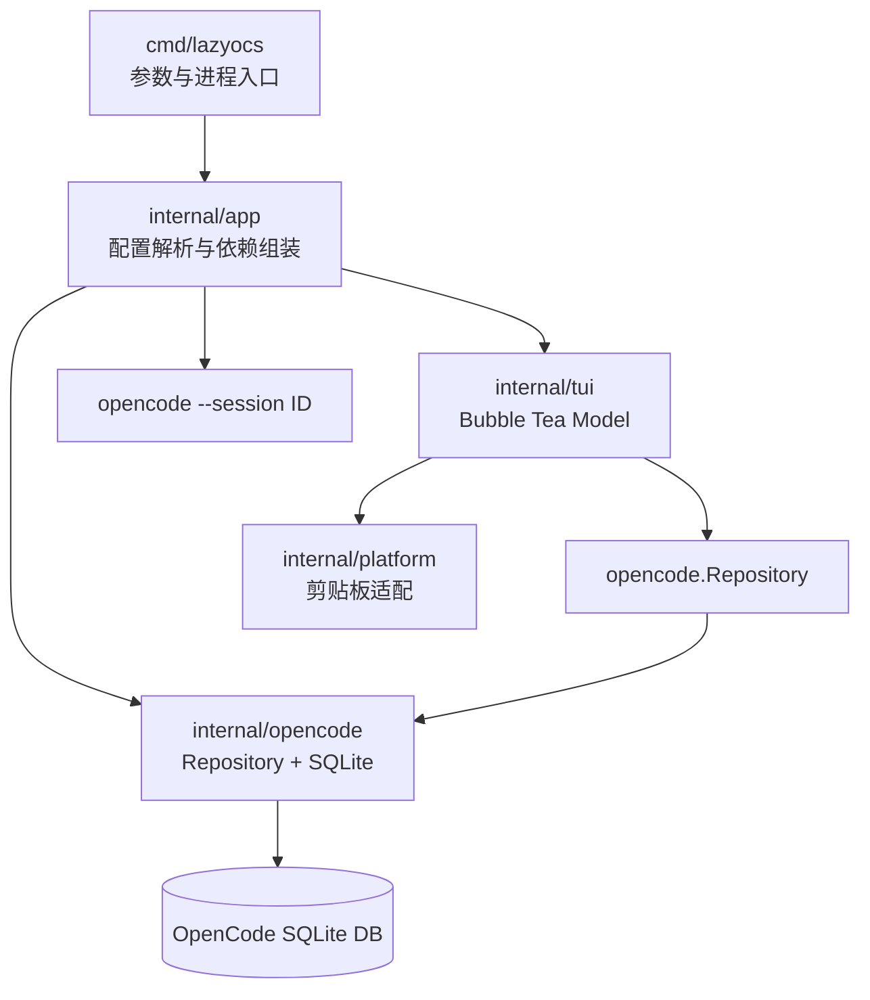

# lazyOpencodeSession 技术文档导航

## 项目一句话介绍

`lazyOpencodeSession` 是一个使用 Go、Bubble Tea 和 SQLite 实现的 OpenCode 会话管理 TUI。它面向长期使用 OpenCode 后“会话数量多、定位困难、恢复路径长”的问题，在不默认扫描大体积消息正文的前提下，提供会话浏览、组合搜索、详情查看、消息预览、标题修改、删除和一键恢复。

命令名为 `lazyocs`。

## 为什么这个项目适合作为求职作品

这个项目不只是一个终端界面，它覆盖了一个完整客户端工具需要处理的多类工程问题：

- 使用 Bubble Tea 的 Elm Architecture 管理状态、事件和异步副作用。
- 直接面对一个可能达到数 GB 的真实 SQLite 数据库，区分元数据查询与 payload 查询。
- 通过 Repository 接口隔离 TUI 和数据库实现。
- 同时处理只读访问、写操作、外键级联和破坏性操作确认。
- 实现配置优先级、国际化、终端响应式布局和平台剪贴板适配。
- 使用纯 Go SQLite 驱动，保持单二进制分发能力。
- 对 schema 漂移、查询节流、可恢复删除和跨平台发布保留明确的演进方案。

项目有意控制抽象数量。当前规模下没有引入只做转发的 service 层，而是保持 `cmd -> app -> tui/repository` 的短调用链；只有当删除备份、审计或批量操作形成真正业务规则时，才计划引入 service 层。

## 已实现功能

| 能力 | 交互 | 实现重点 |
| --- | --- | --- |
| 会话列表 | 启动自动加载 | session 元数据按更新时间倒序，近期记忆并行加载 |
| 多关键词搜索 | `/` | 元数据与最近 N 天用户消息组合匹配，关键词使用 AND 语义 |
| 会话详情 | 移动选中项 | 可配置字段，不读取消息 payload |
| 消息预览 | `p` | 按需读取最近用户文本，限制数量与长度 |
| 标题修改 | `e` | 浮层输入、空值校验、异步 SQL 更新 |
| 删除 session | `d` | 浮层二次确认、递归删除子 session、外键级联 |
| 恢复 session | `Enter` | 退出 TUI 后以前台进程方式启动 OpenCode |
| 复制 session ID | `y` | Linux Wayland/X11 与 macOS 剪贴板适配 |
| 中英文界面 | 配置或 CLI | 自动识别 locale，可显式覆盖 |
| 配置文件 | 首次运行生成 | TOML、CLI 覆盖配置、字段级显示控制 |
| 只读保护 | `--read-only` | SQLite `mode=ro`，从数据源层禁止写入 |

## 推荐阅读路线

### 5 分钟：快速了解项目

1. 阅读仓库根目录的 [`README.md`](../README.md)。
2. 阅读本文的功能表和下方架构图。
3. 查看 [`cmd/lazyocs/main.go`](../cmd/lazyocs/main.go) 理解启动入口。

### 15 分钟：理解核心设计

1. 阅读 [`01-architecture.md`](./01-architecture.md)。
2. 查看 [`internal/app/app.go`](../internal/app/app.go) 的应用组装。
3. 查看 [`internal/opencode/repository.go`](../internal/opencode/repository.go) 的数据边界。
4. 查看 [`internal/tui/model.go`](../internal/tui/model.go) 的 `Update`、`handleKey` 和 `View`。

### 30 分钟：技术面试下钻

1. 阅读 [`02-tui-state-machine.md`](./02-tui-state-machine.md)。
2. 阅读 [`03-sqlite-safety-and-performance.md`](./03-sqlite-safety-and-performance.md)。
3. 阅读 [`04-engineering-foundations.md`](./04-engineering-foundations.md)。
4. 阅读 [`05-production-roadmap.md`](./05-production-roadmap.md)。
5. 对照 [`internal/opencode/db_test.go`](../internal/opencode/db_test.go) 和 [`internal/tui/model_test.go`](../internal/tui/model_test.go) 查看验证方式。

## 文档目录

| 文档 | 主要内容 |
| --- | --- |
| [`01-architecture.md`](./01-architecture.md) | 分层、依赖方向、启动流程、读写数据流和设计取舍 |
| [`02-tui-state-machine.md`](./02-tui-state-machine.md) | Bubble Tea 状态机、消息机制、浮层渲染和键盘交互 |
| [`03-sqlite-safety-and-performance.md`](./03-sqlite-safety-and-performance.md) | SQLite 连接、查询、懒加载、级联删除和性能策略 |
| [`04-engineering-foundations.md`](./04-engineering-foundations.md) | 配置、国际化、平台适配、测试现状和代码阅读索引 |
| [`05-production-roadmap.md`](./05-production-roadmap.md) | 上线风险、优先级、持续集成、兼容性与发布计划 |
| [`06-popup-border-alignment.md`](./06-popup-border-alignment.md) | 浮层边框错位根因、Lazygit 对比、cell buffer 修复方案与验收标准 |
| [`07-production-hardening-before-after.md`](./07-production-hardening-before-after.md) | 上线前七项稳定性工作的用途、Before/After 对照、验收标准和面试讲法 |
| [`08-why-delete-impact-analysis.md`](./08-why-delete-impact-analysis.md) | 删除影响范围是否值得实现、最小方案、性能边界和反方条件 |
| [`09-recent-memory-search.md`](./09-recent-memory-search.md) | 最近 N 天用户消息搜索、极简交互、索引路径和隐私边界 |
| [`mvp-design.md`](./mvp-design.md) | 最初的产品定位、MVP 范围和早期技术选型 |

## 架构概览

## 面试时可以重点讲什么

1. 为什么面对大数据库时，优化重点不是“换更快语言”，而是控制查询边界，不在启动路径扫描 `message.data` 和 `part.data`。
2. 为什么 Bubble Tea 的 `tea.Cmd -> tea.Msg -> Update` 能把数据库 I/O 与界面状态更新分离。
3. 为什么恢复会话不是在 TUI 内嵌套启动，而是退出 alternate screen 后再启动 OpenCode。
4. 为什么删除只操作 OpenCode 已有 schema，不给上游数据库增加私有字段。
5. 为什么当前不急于增加 service 层，但计划在备份、审计和批量操作出现后引入。
6. 为什么公开发布前必须增加 schema 兼容检查，而不能假设 OpenCode 内部表结构永久稳定。

## 当前状态说明

项目当前已经具备完整的本地 MVP 使用路径，并已完成异步跨平台剪贴板、标题输入加固、操作级错误恢复、搜索 debounce、数据库 schema 能力检查、正式连接集成测试、TUI 职责拆分、最小 CI 和删除影响范围复核。下一阶段重点是可选一致性备份和首个版本发布材料。
